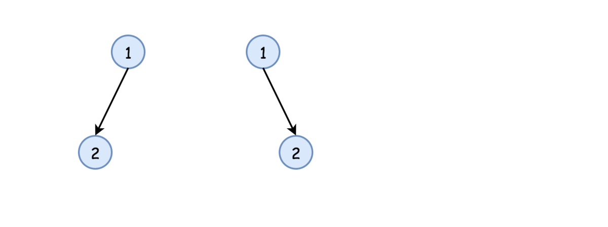

# 官方题解

## 方法一：递归

### 直觉

最简单的策略是使用递归。首先判断 `p` 和 `q` 是不是 `None`，然后判断它们的值是否相等。若以上判断通过，则递归对子结点做同样操作。

### 实现



Python：

```python
class Solution:
    def isSameTree(self, p, q):
        """
        :type p: TreeNode
        :type q: TreeNode
        :rtype: bool
        """
        # p and q are both None
        if not p and not q:
            return True
        # one of p and q is None
        if not q or not p:
            return False
        if p.val != q.val:
            return False
        return self.isSameTree(p.right, q.right) and \
               self.isSameTree(p.left, q.left)
```

Java：

```java
/**
 * Definition for a binary tree node.
 * public class TreeNode {
 *     int val;
 *     TreeNode left;
 *     TreeNode right;
 *     TreeNode(int x) { val = x; }
 * }
 */
class Solution {
  public boolean isSameTree(TreeNode p, TreeNode q) {
    // p and q are both null
    if (p == null && q == null) return true;
    // one of p and q is null
    if (q == null || p == null) return false;
    if (p.val != q.val) return false;
    return isSameTree(p.right, q.right) &&
            isSameTree(p.left, q.left);
  }
}
```

### 复杂度分析

* 时间复杂度：$O(N)$，其中 $N$ 是树的结点数，因为每个节点都访问一次
* 空间复杂度 : 最优情况（完全平衡二叉树）时为 $O(\log(N))$，最坏情况下（完全不平衡二叉树）时为 $O(N)$，用于维护递归栈。

## 方法二：迭代

### 直觉

从根开始，每次迭代将当前结点从双向队列中弹出。然后，进行方法一中的判断：

* `p` 和 `q` 不是 `None`，
* `p.val` 等于 `q.val`，

若以上均满足，则压入子结点。

### 实现

Python:

```python
from collections import deque
class Solution:
    def isSameTree(self, p, q):
        """
        :type p: TreeNode
        :type q: TreeNode
        :rtype: bool
        """
        def check(p, q):
            # if both are None
            if not p and not q:
                return True
            # one of p and q is None
            if not q or not p:
                return False
            if p.val != q.val:
                return False
            return True

        deq = deque([(p, q),])
        while deq:
            p, q = deq.popleft()
            if not check(p, q):
                return False

            if p:
                deq.append((p.left, q.left))
                deq.append((p.right, q.right))

        return True
```

Java:

```java
class Solution {
  public boolean check(TreeNode p, TreeNode q) {
    // p and q are null
    if (p == null && q == null) return true;
    // one of p and q is null
    if (q == null || p == null) return false;
    if (p.val != q.val) return false;
    return true;
  }

  public boolean isSameTree(TreeNode p, TreeNode q) {
    if (p == null && q == null) return true;
    if (!check(p, q)) return false;

    // init deques
    ArrayDeque<TreeNode> deqP = new ArrayDeque<TreeNode>();
    ArrayDeque<TreeNode> deqQ = new ArrayDeque<TreeNode>();
    deqP.addLast(p);
    deqQ.addLast(q);

    while (!deqP.isEmpty()) {
      p = deqP.removeFirst();
      q = deqQ.removeFirst();

      if (!check(p, q)) return false;
      if (p != null) {
        // in Java nulls are not allowed in Deque
        if (!check(p.left, q.left)) return false;
        if (p.left != null) {
          deqP.addLast(p.left);
          deqQ.addLast(q.left);
        }
        if (!check(p.right, q.right)) return false;
        if (p.right != null) {
          deqP.addLast(p.right);
          deqQ.addLast(q.right);
        }
      }
    }
    return true;
  }
}
```

### 复杂度分析

* 时间复杂度：$O(N)$，其中 $N$ 是树的结点数，因为每个结点都访问一次。
* 空间复杂度 : 最优情况（完全平衡二叉树）时为 $O(\log(N))$，最坏情况下（完全不平衡二叉树）时为 $O(N)$，用于维护双向队列。

> 对于空间复杂度，我认为官方题解的分析有误。对于空间复杂度，迭代法的最优情况应该是完全偏斜一侧的树，为 $O(1)$；最坏情况是完全平衡二叉树，时间复杂度为 $O(N)$。

***

# Solution

## Approach 1: Recursion

### Intuition

The simplest strategy here is to use recursion. Check if `p` and `q` nodes are not `None`, and their values are equal. If all checks are OK, do the same for the child nodes recursively.

### Implementation


Python：

```python
class Solution:
    def isSameTree(self, p, q):
        """
        :type p: TreeNode
        :type q: TreeNode
        :rtype: bool
        """
        # p and q are both None
        if not p and not q:
            return True
        # one of p and q is None
        if not q or not p:
            return False
        if p.val != q.val:
            return False
        return self.isSameTree(p.right, q.right) and \
               self.isSameTree(p.left, q.left)
```

Java：

```java
/**
 * Definition for a binary tree node.
 * public class TreeNode {
 *     int val;
 *     TreeNode left;
 *     TreeNode right;
 *     TreeNode(int x) { val = x; }
 * }
 */
class Solution {
  public boolean isSameTree(TreeNode p, TreeNode q) {
    // p and q are both null
    if (p == null && q == null) return true;
    // one of p and q is null
    if (q == null || p == null) return false;
    if (p.val != q.val) return false;
    return isSameTree(p.right, q.right) &&
            isSameTree(p.left, q.left);
  }
}
```

### Complexity Analysis

* Time complexity: $O(N)$, where N is a number of nodes in the tree, since one visits each node exactly once.
* Space complexity: $O(\log(N))$ in the best case of completely balanced tree and $O(N)$ in the worst case of completely unbalanced tree, to keep a recursion stack.

## Approach 2: Iteration

### Intuition

Start from the root and then at each iteration pop the current node out of the deque. Then do the same checks as in the approach 1 :

* `p` and `p` are not `None`,
* `p.val` is equal to `q.val`,

and if checks are OK, push the child nodes.

### Implementation

Python:

```python
from collections import deque
class Solution:
    def isSameTree(self, p, q):
        """
        :type p: TreeNode
        :type q: TreeNode
        :rtype: bool
        """
        def check(p, q):
            # if both are None
            if not p and not q:
                return True
            # one of p and q is None
            if not q or not p:
                return False
            if p.val != q.val:
                return False
            return True

        deq = deque([(p, q),])
        while deq:
            p, q = deq.popleft()
            if not check(p, q):
                return False

            if p:
                deq.append((p.left, q.left))
                deq.append((p.right, q.right))

        return True
```

Java:

```java
class Solution {
  public boolean check(TreeNode p, TreeNode q) {
    // p and q are null
    if (p == null && q == null) return true;
    // one of p and q is null
    if (q == null || p == null) return false;
    if (p.val != q.val) return false;
    return true;
  }

  public boolean isSameTree(TreeNode p, TreeNode q) {
    if (p == null && q == null) return true;
    if (!check(p, q)) return false;

    // init deques
    ArrayDeque<TreeNode> deqP = new ArrayDeque<TreeNode>();
    ArrayDeque<TreeNode> deqQ = new ArrayDeque<TreeNode>();
    deqP.addLast(p);
    deqQ.addLast(q);

    while (!deqP.isEmpty()) {
      p = deqP.removeFirst();
      q = deqQ.removeFirst();

      if (!check(p, q)) return false;
      if (p != null) {
        // in Java nulls are not allowed in Deque
        if (!check(p.left, q.left)) return false;
        if (p.left != null) {
          deqP.addLast(p.left);
          deqQ.addLast(q.left);
        }
        if (!check(p.right, q.right)) return false;
        if (p.right != null) {
          deqP.addLast(p.right);
          deqQ.addLast(q.right);
        }
      }
    }
    return true;
  }
}
```

### Complexity Analysis

* Time complexity: $O(N)$ since each node is visited exactly once.
* Space complexity: $O(\log(N))$ in the best case of completely balanced tree and $O(N)$ in the worst case of completely unbalanced tree, to keep a deque.

> From comment:
> For iterative version, the space complexity is linear, i.e. the worst case is completely balanced tree where the very last level contains half of the nodes, and all of those will be on a queue at the same time.
> The best case for space complexity is completely unbalanced tree when you always keep exactly 1 node on queue.
