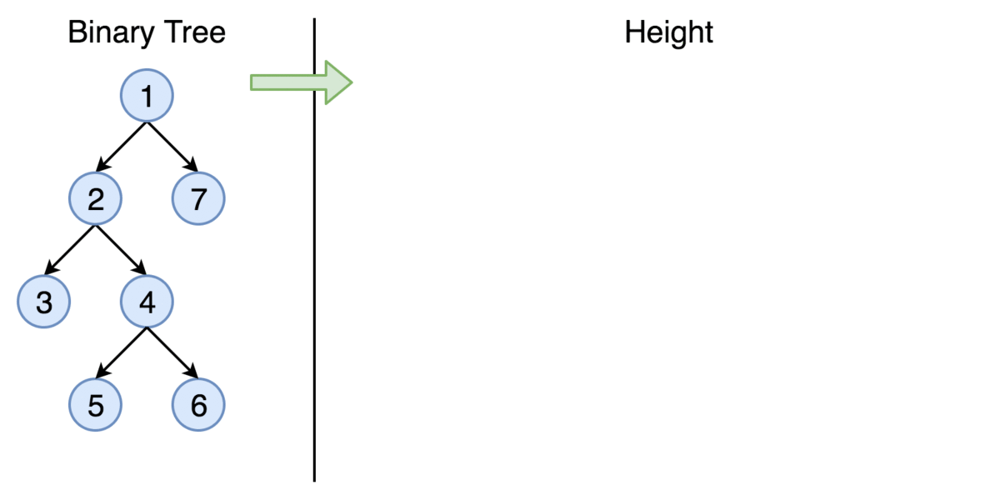

# 官方题解

## 树的定义

首先，给出我们将要使用的树的结点 `TreeNode` 的定义。

Java:

```java
  /* Definition for a binary tree node. */
  public class TreeNode {
    int val;
    TreeNode left;
    TreeNode right;

    TreeNode(int x) {
      val = x;
    }
  }
```

Python:

```python
class TreeNode(object):
    """ Definition of a binary tree node."""
    def __init__(self, x):
        self.val = x
        self.left = None
        self.right = None
```

## 方法一：递归

### 算法



直观的方法是通过递归来解决问题。在这里，我们演示了 DFS（深度优先搜索）策略的示例。

Java:

```Java
class Solution {
  public int maxDepth(TreeNode root) {
    if (root == null) {
      return 0;
    } else {
      int left_height = maxDepth(root.left);
      int right_height = maxDepth(root.right);
      return java.lang.Math.max(left_height, right_height) + 1;
    }
  }
}
```

Python:

```Python
class Solution:
    def maxDepth(self, root):
        """
        :type root: TreeNode
        :rtype: int
        """
        if root is None:
            return 0
        else:
            left_height = self.maxDepth(root.left)
            right_height = self.maxDepth(root.right)
            return max(left_height, right_height) + 1
```

### 复杂度分析

* 时间复杂度。我们每个结点只访问一次，因此时间复杂度为 $O(N)$，其中 $N$ 是结点的数量。
* 空间复杂度：在最糟糕的情况下，树是完全不平衡的，例如每个结点只剩下左子结点，递归将会被调用 $N$ 次（树的高度），因此保持调用栈的存储将是 $O(N)$。但在最好的情况下（树是完全平衡的），树的高度将是 $\log(N)$。因此，在这种情况下的空间复杂度将是 $O(\log(N))$。

## 方法二：迭代

我们还可以在栈的帮助下将上面的递归转换为迭代。

> 我们的想法是使用 DFS 策略访问每个结点，同时在每次访问时更新最大深度。

所以我们从包含根结点且相应深度为 $1$ 的栈开始。然后我们继续迭代：将当前结点弹出栈并推入子结点。每一步都会更新深度。

Java:

```java
import javafx.util.Pair;
import java.lang.Math;

class Solution {
  public int maxDepth(TreeNode root) {
    Queue<Pair<TreeNode, Integer>> stack = new LinkedList<>();
    if (root != null) {
      stack.add(new Pair(root, 1));
    }

    int depth = 0;
    while (!stack.isEmpty()) {
      Pair<TreeNode, Integer> current = stack.poll();
      root = current.getKey();
      int current_depth = current.getValue();
      if (root != null) {
        depth = Math.max(depth, current_depth);
        stack.add(new Pair(root.left, current_depth + 1));
        stack.add(new Pair(root.right, current_depth + 1));
      }
    }
    return depth;
  }
};
```

Python:

```python
class Solution:
    def maxDepth(self, root):
        """
        :type root: TreeNode
        :rtype: int
        """
        stack = []
        if root is not None:
            stack.append((1, root))

        depth = 0
        while stack != []:
            current_depth, root = stack.pop()
            if root is not None:
                depth = max(depth, current_depth)
                stack.append((current_depth + 1, root.left))
                stack.append((current_depth + 1, root.right))

        return depth
```

### 复杂度分析

* 时间复杂度：$O(N)$。
* 空间复杂度：$O(N)$。
