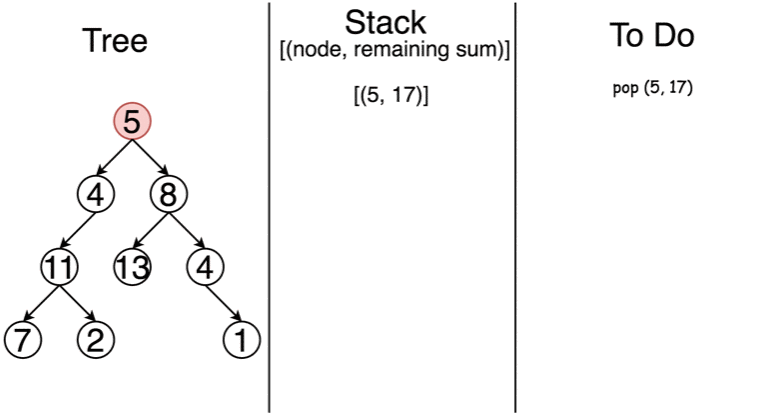

# 官方题解

首先，定义一下二叉树的结构 `TreeNode`。

Java:

```java
/* Definition for a binary tree node. */
public class TreeNode {
  int val;
  TreeNode left;
  TreeNode right;

  TreeNode(int x) {n
    val = x;
  }
}
```

Python:

```python
class TreeNode(object):
    """ Definition of a binary tree node."""
    def __init__(self, x):
        self.val = x
        self.left = None
        self.right = None
```

## 方法 1：递归

### 算法

最直接的方法就是利用递归，遍历整棵树：如果当前节点不是叶子，对它的所有孩子节点，递归调用 `hasPathSum` 函数，其中 sum 值减去当前节点的权值；如果当前节点是叶子，检查 sum 值是否为 0，也就是是否找到了给定的目标和。

Java:

```java
class Solution {
  public boolean hasPathSum(TreeNode root, int sum) {
    if (root == null)
      return false;

    sum -= root.val;
    if ((root.left == null) && (root.right == null))
      return (sum == 0);
    return hasPathSum(root.left, sum) || hasPathSum(root.right, sum);
  }
}
```

Python:

```python
class Solution:
    def hasPathSum(self, root, sum):
        """
        :type root: TreeNode
        :type sum: int
        :rtype: bool
        """
        if not root:
            return False

        sum -= root.val
        if not root.left and not root.right:  # if reach a leaf
            return sum == 0
        return self.hasPathSum(root.left, sum) or self.hasPathSum(root.right, sum)
```

### 复杂度分析

* 时间复杂度：我们访问每个节点一次，时间复杂度为 $O(N)$，其中 $N$ 是节点个数。
* 空间复杂度：最坏情况下，整棵树是非平衡的，例如每个节点都只有一个孩子，递归会调用 $N$ 次（树的高度），因此栈的空间开销是 $O(N)$。但在最好情况下，树是完全平衡的，高度只有 $\log(N)$，因此在这种情况下空间复杂度只有 $O(\log(N))$。

## 方法 2：迭代

### 算法

我们可以用栈将递归转成迭代的形式。深度优先搜索在除了最坏情况下都比广度优先搜索更快。最坏情况是指满足目标和的 `root->leaf` 路径是最后被考虑的，这种情况下深度优先搜索和广度优先搜索代价是相通的。

> 利用深度优先策略访问每个节点，同时更新剩余的目标和。

所以我们从包含根节点的栈开始模拟，剩余目标和为 `sum - root.val`。

然后开始迭代：弹出当前元素，如果当前剩余目标和为 `0` 并且在叶子节点上返回 `True`；如果剩余和不为零并且还处在非叶子节点上，将当前节点的所有孩子以及对应的剩余和压入栈中。



Java:

```java
class Solution {
  public boolean hasPathSum(TreeNode root, int sum) {
    if (root == null)
      return false;

    LinkedList<TreeNode> node_stack = new LinkedList();
    LinkedList<Integer> sum_stack = new LinkedList();
    node_stack.add(root);
    sum_stack.add(sum - root.val);

    TreeNode node;
    int curr_sum;
    while ( !node_stack.isEmpty() ) {
      node = node_stack.pollLast();
      curr_sum = sum_stack.pollLast();
      if ((node.right == null) && (node.left == null) && (curr_sum == 0))
        return true;

      if (node.right != null) {
        node_stack.add(node.right);
        sum_stack.add(curr_sum - node.right.val);
      }
      if (node.left != null) {
        node_stack.add(node.left);
        sum_stack.add(curr_sum - node.left.val);
      }
    }
    return false;
  }
}
```

Python:

```python
class Solution:
    def hasPathSum(self, root, sum):
        """
        :type root: TreeNode
        :type sum: int
        :rtype: bool
        """
        if not root:
            return False

        de = [(root, sum - root.val), ]
        while de:
            node, curr_sum = de.pop()
            if not node.left and not node.right and curr_sum == 0:  
                return True
            if node.right:
                de.append((node.right, curr_sum - node.right.val))
            if node.left:
                de.append((node.left, curr_sum - node.left.val))
        return False
```

### 复杂度分析

* 时间复杂度：和递归方法相同是 $O(N)$。
* 空间复杂度：当树不平衡的最坏情况下是 $O(N)$。在最好情况（树是平衡的）下是 $O(\log N)$。
