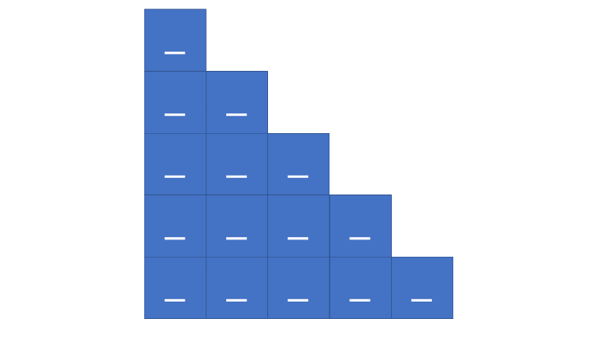

# 官方题解

## 方法：动态规划

### 思路

如果能够知道一行杨辉三角，我们就可以根据每对相邻的值轻松地计算出它的下一行。

### 算法

虽然这一算法非常简单，但用于构造杨辉三角的迭代方法可以归类为动态规划，因为我们需要基于前一行来构造每一行。

首先，我们会生成整个 `triangle` 列表，三角形的每一行都以子列表的形式存储。然后，我们会检查行数为 $0$ 的特殊情况，否则我们会返回 $[1]$。如果 $numRows > 0$，那么我们用 $[1]$ 作为第一行来初始化 `triangle` with $[1]$，并按如下方式继续填充：



Java:

```java
class Solution {
    public List<List<Integer>> generate(int numRows) {
        List<List<Integer>> triangle = new ArrayList<List<Integer>>();

        // First base case; if user requests zero rows, they get zero rows.
        if (numRows == 0) {
            return triangle;
        }

        // Second base case; first row is always [1].
        triangle.add(new ArrayList<>());
        triangle.get(0).add(1);

        for (int rowNum = 1; rowNum < numRows; rowNum++) {
            List<Integer> row = new ArrayList<>();
            List<Integer> prevRow = triangle.get(rowNum-1);

            // The first row element is always 1.
            row.add(1);

            // Each triangle element (other than the first and last of each row)
            // is equal to the sum of the elements above-and-to-the-left and
            // above-and-to-the-right.
            for (int j = 1; j < rowNum; j++) {
                row.add(prevRow.get(j-1) + prevRow.get(j));
            }

            // The last row element is always 1.
            row.add(1);

            triangle.add(row);
        }

        return triangle;
    }
}
```

Python:

```python
class Solution:
    def generate(self, num_rows):
        triangle = []

        for row_num in range(num_rows):
            # The first and last row elements are always 1.
            row = [None for _ in range(row_num+1)]
            row[0], row[-1] = 1, 1

            # Each triangle element is equal to the sum of the elements
            # above-and-to-the-left and above-and-to-the-right.
            for j in range(1, len(row)-1):
                row[j] = triangle[row_num-1][j-1] + triangle[row_num-1][j]

            triangle.append(row)

        return triangle
```

### 复杂度分析

* 时间复杂度：$O(numRows^2)$  
虽然更新 `triangle` 中的每个值都是在常量时间内发生的，但它会被执行 $O(numRows^2)$ 次。想要了解原因,就需要考虑总共有多少次循环迭代。很明显外层循环需要运行 $numRows$ 次，但在外层循环的每次迭代中，内层循环要运行 $rowNum$ 次。因此，`triangle` 发生的更新总数为 $1 + 2 + 3 + \ldots + numRows$，根据高斯公式,有  

$$
\begin{aligned}
\frac{numRows(numRows + 1)}{2} &= \frac{numRows^2 + numRows}{2} \\[2ex]
&= \frac{numRows^2}{2} + \frac{numRows}{2} \\[2ex]
&= O(numRows^2)
\end{aligned}
$$

* 空间复杂度 $O(numRows^2)$  
因为我们需要存储我们在 `triangle` 中更新的每个数字，所以空间需求与时间复杂度相同。

***

# Solution

## Approach 1: Dynamic Programming

### Intuition

If we have the a row of Pascal's triangle, we can easily compute the next row by each pair of adjacent values.

### Algorithm

Although the algorithm is very simple, the iterative approach to constructing Pascal's triangle can be classified as dynamic programming because we construct each row based on the previous row.

First, we generate the overall `triangle` list, which will store each row as a sublist. Then, we check for the special case of $0$, as we would otherwise return $[1]$. If $numRows > 0$, then we initialize `triangle` with $[1]$ as its first row, and proceed to fill the rows as follows:


Java:

```java
class Solution {
    public List<List<Integer>> generate(int numRows) {
        List<List<Integer>> triangle = new ArrayList<List<Integer>>();

        // First base case; if user requests zero rows, they get zero rows.
        if (numRows == 0) {
            return triangle;
        }

        // Second base case; first row is always [1].
        triangle.add(new ArrayList<>());
        triangle.get(0).add(1);

        for (int rowNum = 1; rowNum < numRows; rowNum++) {
            List<Integer> row = new ArrayList<>();
            List<Integer> prevRow = triangle.get(rowNum-1);

            // The first row element is always 1.
            row.add(1);

            // Each triangle element (other than the first and last of each row)
            // is equal to the sum of the elements above-and-to-the-left and
            // above-and-to-the-right.
            for (int j = 1; j < rowNum; j++) {
                row.add(prevRow.get(j-1) + prevRow.get(j));
            }

            // The last row element is always 1.
            row.add(1);

            triangle.add(row);
        }

        return triangle;
    }
}
```

Python:

```python
class Solution:
    def generate(self, num_rows):
        triangle = []

        for row_num in range(num_rows):
            # The first and last row elements are always 1.
            row = [None for _ in range(row_num+1)]
            row[0], row[-1] = 1, 1

            # Each triangle element is equal to the sum of the elements
            # above-and-to-the-left and above-and-to-the-right.
            for j in range(1, len(row)-1):
                row[j] = triangle[row_num-1][j-1] + triangle[row_num-1][j]

            triangle.append(row)

        return triangle
```

### Complexity Analysis

* Time complexity: $O(numRows^2)$  
Although updating each value of triangle happens in constant time, it is performed $O(numRows^2)$ times. To see why, consider how many overall loop iterations there are. The outer loop obviously runs $numRows$ times, but for each iteration of the outer loop, the inner loop runs $rowNums$ times. Therefore, the overall number of triangle updates that occur is $1+2+3+\cdots+numRows$, which, according to Gauss's formula, is  

$$
\begin{aligned}
\frac{numRows(numRows + 1)}{2} &= \frac{numRows^2 + numRows}{2} \\[2ex]
&= \frac{numRows^2}{2} + \frac{numRows}{2} \\[2ex]
&= O(numRows^2)
\end{aligned}
$$

* Space complexity: $O(numRows^2)$  
Because we need to store each number that we update in `triangle`, the space requirement is the same as the time complexity.
