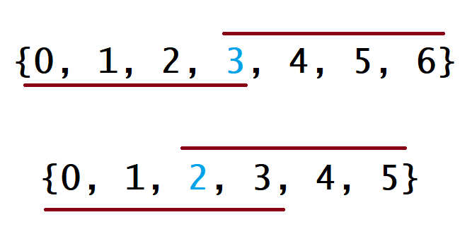

# Solution

## Approach 1: Brute Force

### Intuition

We can exhaust the search space in quadratic time by checking whether each element is the majority element.

### Algorithm

The brute force algorithm iterates over the array, and then iterates again for each number to count its occurrences. As soon as a number is found to have appeared more than any other can possibly have appeared, return it.

Java:

```java
class Solution {
    public int majorityElement(int[] nums) {
        int majorityCount = nums.length/2;

        for (int num : nums) {
            int count = 0;
            for (int elem : nums) {
                if (elem == num) {
                    count += 1;
                }
            }

            if (count > majorityCount) {
                return num;
            }

        }

        return -1;
    }
}
```

Python:

```python
class Solution:
    def majorityElement(self, nums):
        majority_count = len(nums)//2
        for num in nums:
            count = sum(1 for elem in nums if elem == num)
            if count > majority_count:
                return num
```

### Complexity Analysis

* Time complexity: $O(n^2)$

  The brute force algorithm contains two nested `for` loops that each run for $n$ iterations, adding up to quadratic time complexity.

* Space complexity: $O(1)$

  The brute force solution does not allocate additional space proportional to the input size.

## Approach 2: HashMap

### Intuition

We know that the majority element occurs more than $\lfloor \frac{n}{2} \rfloor$ times, and a `HashMap` allows us to count element occurrences efficiently.

### Algorithm

We can use a `HashMap` that maps elements to counts in order to count occurrences in linear time by looping over `nums`. Then, we simply return the key with maximum value.

Java:

```java
class Solution {
    private Map<Integer, Integer> countNums(int[] nums) {
        Map<Integer, Integer> counts = new HashMap<Integer, Integer>();
        for (int num : nums) {
            if (!counts.containsKey(num)) {
                counts.put(num, 1);
            }
            else {
                counts.put(num, counts.get(num)+1);
            }
        }
        return counts;
    }

    public int majorityElement(int[] nums) {
        Map<Integer, Integer> counts = countNums(nums);

        Map.Entry<Integer, Integer> majorityEntry = null;
        for (Map.Entry<Integer, Integer> entry : counts.entrySet()) {
            if (majorityEntry == null || entry.getValue() > majorityEntry.getValue()) {
                majorityEntry = entry;
            }
        }

        return majorityEntry.getKey();
    }
}
```

Python:

```python
class Solution:
    def majorityElement(self, nums):
        counts = collections.Counter(nums)
        return max(counts.keys(), key=counts.get)
```

### Complexity Analysis

* Time complexity: $O(n)$

  We iterate over `nums` once and make a constant time `HashMap` insertion on each iteration. Therefore, the algorithm runs in $O(n)$ time.

* Space complexity: $O(n)$

  At most, the `HashMap` can contain $n-\lfloor \frac{n}{2}\rfloor$ associations, so it occupies $O(n)$ space. This is because an arbitrary array of length $n$ can contain $n$ distinct values, but `nums` is guaranteed to contain a majority element, which will occupy (at minimum) $\lfloor \frac{n}{2} \rfloor + 1$ array indices. Therefore, $n-(\lfloor \frac{n}{2} \rfloor + 1)$ indices can be occupied by distinct, non-majority elements (plus 1 for the majority element itself), leaving us with (at most) $n-\lfloor \frac{n}{2}\rfloor$ distinct elements.

## Approach 3: Sorting

### Intuition

If the elements are sorted in monotonically increasing (or decreasing) order, the majority element can be found at index $\lfloor \frac{n}{2} \rfloor$ (and $\lfloor \frac{n}{2} \rfloor + 1$, incidentally, if $n$ is even).

### Algorithm

For this algorithm, we simply do exactly what is described: sort `nums`, and return the element in question. To see why this will always return the majority element (given that the array has one), consider the figure below (the top example is for an odd-length array and the bottom is for an even-length array):



For each example, the line below the array denotes the range of indices that are covered by a majority element that happens to be the array minimum. As you might expect, the line above the array is similar, but for the case where the majority element is also the array maximum. In all other cases, this line will lie somewhere between these two, but notice that even in these two most extreme cases, they overlap at index $\lfloor \frac{n}{2} \rfloor$ for both even- and odd-length arrays. Therefore, no matter what value the majority element has in relation to the rest of the array, returning the value at $\lfloor \frac{n}{2} \rfloor$ will never be wrong.

Java:

```java
class Solution {
    public int majorityElement(int[] nums) {
        Arrays.sort(nums);
        return nums[nums.length/2];
    }
}
```

Python:

```python
class Solution:
    def majorityElement(self, nums):
        nums.sort()
        return nums[len(nums)//2]
```

### Complexity Analysis

* Time complexity: $O(n\lg n)$

  Sorting the array costs $O(n \lg n)$ time in Python and Java, so it dominates the overall runtime.

* Space complexity: $O(1)$ or $O(n)$

  We sorted `nums` in place here - if that is not allowed, then we must spend linear additional space on a copy of `nums` and sort the copy instead.

## Approach 4: Randomization

### Intuition

Because more than $\lfloor \frac{n}{2} \rfloor$ array indices are occupied by the majority element, a random array index is likely to contain the majority element.

### Algorithm

Because a given index is likely to have the majority element, we can just select a random index, check whether its value is the majority element, return if it is, and repeat if it is not. The algorithm is verifiably correct because we ensure that the randomly chosen value is the majority element before ever returning.

Java:

```java
class Solution {
    private int randRange(Random rand, int min, int max) {
        return rand.nextInt(max - min) + min;
    }

    private int countOccurences(int[] nums, int num) {
        int count = 0;
        for (int i = 0; i < nums.length; i++) {
            if (nums[i] == num) {
                count++;
            }
        }
        return count;
    }

    public int majorityElement(int[] nums) {
        Random rand = new Random();

        int majorityCount = nums.length/2;

        while (true) {
            int candidate = nums[randRange(rand, 0, nums.length)];
            if (countOccurences(nums, candidate) > majorityCount) {
                return candidate;
            }
        }
    }
}
```

Python:

```python
import random

class Solution:
    def majorityElement(self, nums):
        majority_count = len(nums)//2
        while True:
            candidate = random.choice(nums)
            if sum(1 for elem in nums if elem == candidate) > majority_count:
                return candidate
```

### Complexity Analysis

* Time complexity: $O(\infty)$

  It is technically possible for this algorithm to run indefinitely (if we never manage to randomly select the majority element), so the worst possible runtime is unbounded. However, the expected runtime is far better - linear, in fact. For ease of analysis, convince yourself that because the majority element is guaranteed to occupy *more* than half of the array, the expected number of iterations will be less than it would be if the element we sought occupied exactly *half* of the array. Therefore, we can calculate the expected number of iterations for this modified version of the problem and assert that our version is easier.

  $$
  \begin{aligned}
  EV({iters}_{prob}) &\leq EV({iters}_{mod}) \\[2ex]
  &= \lim_{n \to \infty} \sum_{i=1}^n i \cdot \frac{1}{2^i} \\[2ex]
  &= 2
  \end{aligned}
  $$

  Because the series converges, the expected number of iterations for the modified problem is constant. Based on an expected-constant number of iterations in which we perform linear work, the expected runtime is linear for the modifed problem. Therefore, the expected runtime for our problem is also linear, as the runtime of the modifed problem serves as an upper bound for it.

* Space complexity: $O(1)$

  Much like the brute force solution, the randomized approach runs with constant additional space.

## Approach 5: Divide and Conquer

### Intuition

If we know the majority element in the left and right halves of an array, we can determine which is the global majority element in linear time.

### Algorithm

Here, we apply a classical divide & conquer approach that recurses on the left and right halves of an array until an answer can be trivially achieved for a length-1 array. Note that because actually passing copies of subarrays costs time and space, we instead pass `lo` and `hi` indices that describe the relevant slice of the overall array. In this case, the majority element for a length-1 slice is trivially its only element, so the recursion stops there. If the current slice is longer than length-1, we must combine the answers for the slice's left and right halves. If they agree on the majority element, then the majority element for the overall slice is obviously the same. If they disagree, only one of them can be "right", so we need to count the occurrences of the left and right majority elements to determine which subslice's answer is globally correct. The overall answer for the array is thus the majority element between indices $0$ and $n$.

Java:

```java
class Solution {
    private int countInRange(int[] nums, int num, int lo, int hi) {
        int count = 0;
        for (int i = lo; i <= hi; i++) {
            if (nums[i] == num) {
                count++;
            }
        }
        return count;
    }

    private int majorityElementRec(int[] nums, int lo, int hi) {
        // base case; the only element in an array of size 1 is the majority
        // element.
        if (lo == hi) {
            return nums[lo];
        }

        // recurse on left and right halves of this slice.
        int mid = (hi-lo)/2 + lo;
        int left = majorityElementRec(nums, lo, mid);
        int right = majorityElementRec(nums, mid+1, hi);

        // if the two halves agree on the majority element, return it.
        if (left == right) {
            return left;
        }

        // otherwise, count each element and return the "winner".
        int leftCount = countInRange(nums, left, lo, hi);
        int rightCount = countInRange(nums, right, lo, hi);

        return leftCount > rightCount ? left : right;
    }

    public int majorityElement(int[] nums) {
        return majorityElementRec(nums, 0, nums.length-1);
    }
}
```

Python:

```python
class Solution:
    def majorityElement(self, nums, lo=0, hi=None):
        def majority_element_rec(lo, hi):
            # base case; the only element in an array of size 1 is the majority
            # element.
            if lo == hi:
                return nums[lo]

            # recurse on left and right halves of this slice.
            mid = (hi-lo)//2 + lo
            left = majority_element_rec(lo, mid)
            right = majority_element_rec(mid+1, hi)

            # if the two halves agree on the majority element, return it.
            if left == right:
                return left

            # otherwise, count each element and return the "winner".
            left_count = sum(1 for i in range(lo, hi+1) if nums[i] == left)
            right_count = sum(1 for i in range(lo, hi+1) if nums[i] == right)

            return left if left_count > right_count else right

        return majority_element_rec(0, len(nums)-1)
```

### Complexity Analysis

* Time complexity: $O(n \lg n)$

  Each recursive call to `majority_element_rec` performs two recursive calls on subslices of size $\frac{n}{2}$. Therefore, the time complexity of the divide & conquer approach can be represented by the following recurrence relation:

  $$
  T(n) = 2T(\frac{n}{2}) + 2n
  $$

  By the [master theorem](https://en.wikipedia.org/wiki/Master_theorem_(analysis_of_algorithms)), the recurrence satisfies case 2, so the complexity can be analyzed as such:

  $$
  \begin{aligned}
  T(n) &= \Theta(n^{\log_ba} \log n) \\[2ex]
  &= \Theta(n^{\log_22} \log n) \\[2ex]
  &= \Theta(n \log n)
  \end{aligned}
  $$

* Space complexity: $O(\lg n)$

  Although the divide & conquer does not explicitly allocate any additional memory, it uses a non-constant amount of additional memory in stack frames due to recursion. Because the algorithm "cuts" the array in half at each level of recursion, it follows that there can only be $O(\lg n)$ "cuts" before the base case of 1 is reached. It follows from this fact that the resulting recursion tree is balanced, and therefore all paths from the root to a leaf are of length $O(\lg n)$. Because the recursion tree is traversed in a depth-first manner, the space complexity is therefore equivalent to the length of the longest path, which is, of course, $O(\lg n)$.

## Approach 6: Boyer-Moore Voting Algorithm

### Intuition

If we had some way of counting instances of the majority element as $+1$ and instances of any other element as $-1$, summing them would make it obvious that the majority element is indeed the majority element.

### Algorithm

Essentially, what Boyer-Moore does is look for a suffix $suf$ of `nums` where $suf[0]$ is the majority element in that suffix. To do this, we maintain a count, which is incremented whenever we see an instance of our current candidate for majority element and decremented whenever we see anything else. Whenever `count` equals 0, we effectively forget about everything in `nums` up to the current index and consider the current number as the candidate for majority element. It is not immediately obvious why we can get away with forgetting prefixes of `nums` - consider the following examples (pipes are inserted to separate runs of nonzero `count`).

[7, 7, 5, 7, 5, 1 | 5, 7 | 5, 5, 7, 7 | 7, 7, 7, 7]

Here, the `7` at index 0 is selected to be the first candidate for majority element. `count` will eventually reach 0 after index 5 is processed, so the `5` at index 6 will be the next candidate. In this case, `7` is the true majority element, so by disregarding this prefix, we are ignoring an equal number of majority and minority elements - therefore, `7` will still be the majority element in the suffix formed by throwing away the first prefix.

[7, 7, 5, 7, 5, 1 | 5, 7 | 5, 5, 7, 7 | 5, 5, 5, 5]

Now, the majority element is `5` (we changed the last run of the array from `7`s to `5`s), but our first candidate is still `7`. In this case, our candidate is not the true majority element, but we still cannot discard more majority elements than minority elements (this would imply that `count` could reach -1 before we reassign `candidate`, which is obviously false).

Therefore, given that it is impossible (in both cases) to discard more majority elements than minority elements, we are safe in discarding the prefix and attempting to recursively solve the majority element problem for the suffix. Eventually, a suffix will be found for which `count` does not hit `0`, and the majority element of that suffix will necessarily be the same as the majority element of the overall array.

Java:

```java
class Solution {
    public int majorityElement(int[] nums) {
        int count = 0;
        Integer candidate = null;

        for (int num : nums) {
            if (count == 0) {
                candidate = num;
            }
            count += (num == candidate) ? 1 : -1;
        }

        return candidate;
    }
}
```

Python:

```python
class Solution:
    def majorityElement(self, nums):
        count = 0
        candidate = None

        for num in nums:
            if count == 0:
                candidate = num
            count += (1 if num == candidate else -1)

        return candidate
```

### Complexity Analysis

* Time complexity: $O(n)$
  
  Boyer-Moore performs constant work exactly $n$ times, so the algorithm runs in linear time.

* Space complexity: $O(1)$
  
  Boyer-Moore allocates only constant additional memory.
