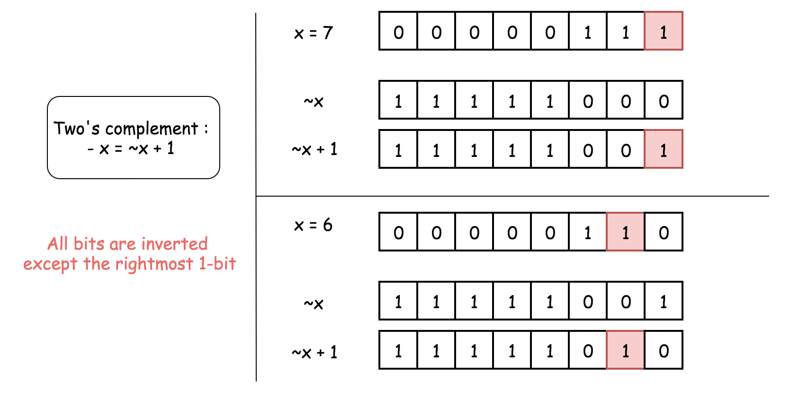
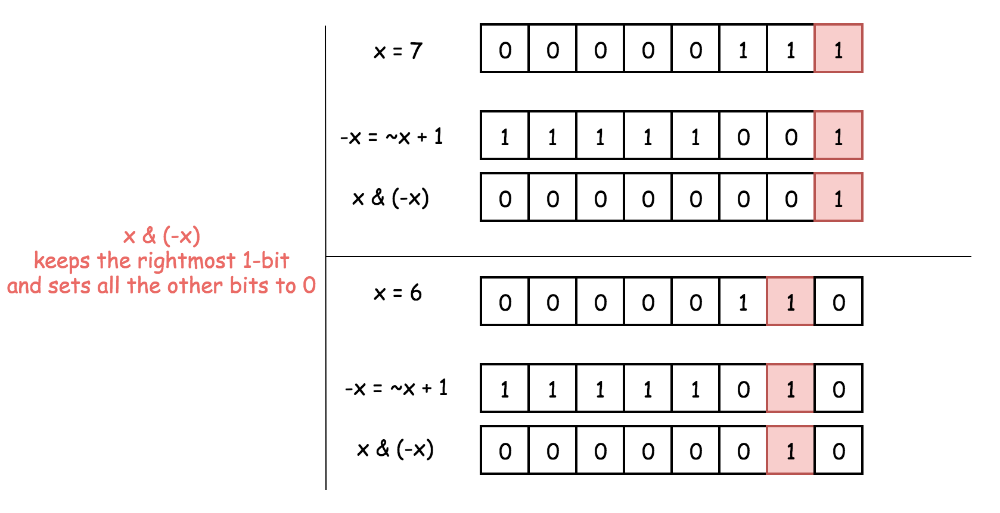
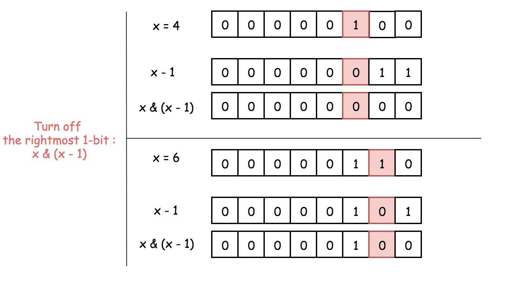
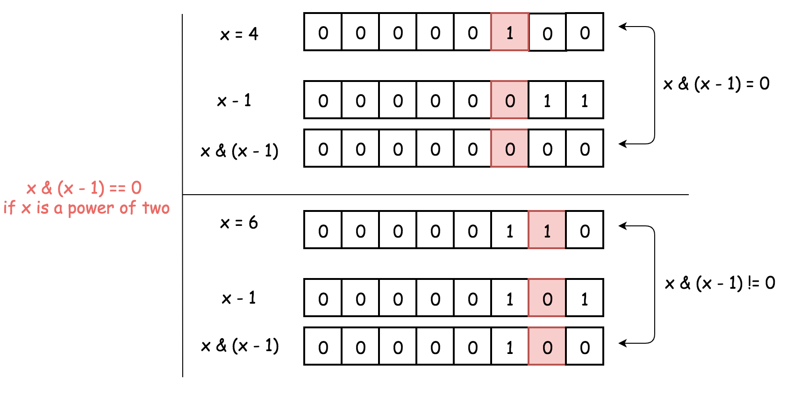

# 官方题解

## 概述

我们不打算在这里讨论时间复杂度为 $O(\log N)$ 的解决方案。

**Python:**

```python
class Solution(object):
    def isPowerOfTwo(self, n):
        if n == 0:
            return False
        while n % 2 == 0:
            n /= 2
        return n == 1
```

**Java:**

```java
class Solution {
  public boolean isPowerOfTwo(int n) {
    if (n == 0) return false;
    while (n % 2 == 0) n /= 2;
    return n == 1;
  }
}
```

该问题将通过位运算在 $O(1)$ 的时间复杂度解决，通过使用如下的按位技巧：

* 如何获取二进制中最右边的 `1`：`x & (-x)`。
* 如何将二进制中最右边的 `1` 设置为 `0`：`x & (x - 1)`。

以下的两种解决方案背后的思想都是一样的：2 的幂在二进制中是有一个 `1` 后跟一些 `0`：

$$
1=(00000001)_2​ \\[2ex]
2=(00000010)_2 \\[2ex]
4=(00000100)_2​ \\[2ex]
8=(00001000)_2​
$$

不是 2 的幂的二进制中有一个以上的 `1`。

$$
3=(00000011)_2​ \\[2ex]
5=(00000101)_2 \\[2ex]
6=(00000110)_2 \\[2ex]
7=(00000111)_2
$$

除了 `0`，我们应该单独处理。

## 方法一：位运算：获取二进制中最右边的 1

### 算法

**获取最右边的 1：**

首先讨论为什么 `x & (-x)` 可以获取到二进制中最右边的 1，且其它位设置为 0。

在补码表示法中，$-x = \lnot x + 1$。换句话说，要计算 $-x$，则要将 $x$ 所有位取反再加 1。

在二进制表示中，$\lnot x + 1$ 表示将该 1 移动到 $\lnot x$ 中最右边的 0 的位置上，并将所有较低位的位设置为 0。而 $\lnot x$ 最右边的 0 的位置对应于 $x$ 最右边的 1 的位置。

总而言之，$-x = \lnot x + 1$，此操作将 $x$ 所有位取反，但是最右边的 1 除外。



因此，$x$ 和 $-x$ 只有一个共同点：最右边的 1。这说明 `x & (-x)` 将保留最右边的 1。并将其他的位设置为 0。



**检测是否为 2 的幂：**

我们通过 `x & (-x)` 保留了最右边的 1，并将其他位设置为 0 若 `x` 为 2 的幂，则它的二进制表示中只包含一个 1，则有 `x & (-x) = x`。

若 `x` 不是 2 的幂，则在二进制表示中存在其他 1，因此 `x & (-x) != x`。

因此判断是否为 2 的幂的关键是：判断 `x & (-x) == x`。


**Python:**

```python
class Solution(object):
    def isPowerOfTwo(self, n):
        if n == 0:
            return False
        return n & (-n) == n
```

**Java:**

```java
class Solution {
  public boolean isPowerOfTwo(int n) {
    if (n == 0) return false;
    long x = (long) n;
    return (x & (-x)) == x;
  }
}
```

**C++:**

```cpp
class Solution {
  public:
  bool isPowerOfTwo(int n) {
    if (n == 0) return false;
    long x = n;
    return (x & (x - 1)) == 0;
  }
};
```

**C:**

```C
bool isPowerOfTwo(int n) {
  if (n == 0) return false;
  long x = n;
  return (x & (x - 1)) == 0;
}
```

### 复杂度分析

* 时间复杂度：$O(1)$。
* 空间复杂度：$O(1)$。

## 方法二：位运算：去除二进制中最右边的 1

### 算法

**去除二进制中最右边的 1：**

首先讨论为什么 `x & (x - 1)` 可以将最右边的 1 设置为 0。

`(x - 1)` 代表了将 `x` 最右边的 1 设置为 0，并且将较低位设置为 1。

再使用与运算：则 `x` 最右边的 1 和就会被设置为 0，因为 `1 & 0 = 0`。



**检测是否为 2 的幂：**

1. 2 的幂二进制表示只含有一个 1。
2. `x & (x - 1)` 操作会将 2 的幂设置为 0，因此判断是否为 2 的幂是：判断 `x & (x - 1) == 0`。



**Python:**

```python
class Solution(object):
    def isPowerOfTwo(self, n):
        if n == 0:
            return False
        return n & (n - 1) == 0
```

**Java:**

```java
class Solution {
  public boolean isPowerOfTwo(int n) {
    if (n == 0) return false;
    long x = (long) n;
    return (x & (x - 1)) == 0;
  }
}
```

### 复杂度分析

* 时间复杂度：$O(1)$。
* 空间复杂度：$O(1)$。
